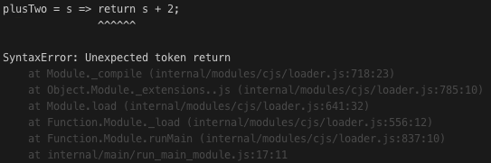

## 1주차 - 1.Arrow Function

[[실습 코드보기]](https://github.com/LikeLionSCH/LikeLion_React_Study_Summary/tree/master/1_Arrow_Function.js)

### 기존의 함수

```javascript
function plusTwo(s) {
    return s + 2;
}
console.log(plusTwo(10)); // 12
```

### Arrow Function

위의 기존 `Javascript`에서 함수를 구현하는 문법을<br>
아래와 같은 `Arrow Function`으로 구현해 사용할 수 있다.<br>

`<함수이름> = {} / () =>`와 같은 기본 구성을 갖고 있으며<br>
인자가 하나일 경우 `<함수이름> = {} / =>`의 구성으로 사용된다.<br>

```javascript
plusTwo = s => {
    return s + 2;
};
console.log(arrowPlusTwo(10)); // 12
```

위의 `Arrow Function`을 아래와 같이 한 줄로 작성할 수도 있다.<br>
아래의 코드와 같이 `return`키워드를 사용하지 않고 사용하면 된다.<br>

```javascript
plusTwo = s => s + 2;
console.log(plusTwo(10)); // 12
```

아래와 같이 `return`키워드를 추가해서 작성하면 에러가 발생한다.<br>

```javascript
plusTwo = s => return s + 2;
consoloe.log(plusTwo(10)) // Error
```

<br>

중괄호`{}`가 없을 경우 `return`키워드를 사용하면 안된다.<br>

### Arrow Function의 활용

#### Map

**배열**또는 **객체**를 더 잘 조작하기 위해 사용한다.<br>

```javascript
arr = [1, 2, 3, 4, 5, 6, 7, 8, 9, 10];
```

파이썬에서는 아래와 같이 사용했었다.<br>

```python
arr = [i * 2 for i in arr]
arr = list(map(lambda x : x * 2, arr))
```

기존의 `javascript`에서는 아래와 같이 `map`을 이용해 할 수 있었다.<br>

```javascript
arr_map = arr.map(function(value) {
    return value * 2;
});
console.log(arr_map); // [2, 4, 6, 8, 10, 12, 14, 16, 18, 20 ]
```

`arrow function`과 `map`을 이용하면 아래와 같이 작성할 수 있다.<br>

```javascript
arr_map = arr.map(v => v * 2);
console.log(arr_map); // [2, 4, 6, 8, 10, 12, 14, 16, 18, 20 ]
```

```javascript
arr_map = arr.map(value => {
    return value * 2;
});
console.log(arr_map); // [2, 4, 6, 8, 10, 12, 14, 16, 18, 20 ]
```

#### Filter

**배열**또는 **객체**에서 값들을 걸러내기 위하여 `filter`함수를 사용한다.<br>
`filter`함수에 **조건**을 주면 그 **조건의 맞는 값**들만 뽑아내게 된다.<br>

```javascript
arr_filter = arr.filter(value => value < 5);
console.log(arr_filter); // [1, 2, 3, 4]
```

```javascript
arr_filter = arr.filter(value => {
    return value < 5;
});
console.log(arr_filter); // [1, 2, 3, 4]
```
