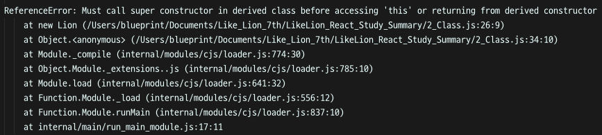

## 1주차 - 2.클래스 상속과 super

[[실습 코드보기]](https://github.com/LikeLionSCH/LikeLion_React_Study_Summary/tree/master/2_Class.js)

### 클래스 정의하기

함수의 정의는 아래와 같이 기본적으로 정의된다.<br>

```javascript
class <클래스이름> {
}
```

### 클래스 생성자 만들기 (Constructor)

파이썬에서는 클래스의 **생성자**를 아래와 같이 **정의**했다.<br>

```python
class Lion:
    def __init__(self, name):
        self.name = name
```

자바스크립트에서는 클래스의 **생성자**를 아래와 같이 **정의**한다.<br>

```javascript
class Lion {
    constructor(name) {
        this.name = name;
    }
}
```

`constructor`함수가 `__init__`함수와 동일한 역할을 한다.<br>
파이썬에서는 **클래스 자신**을 가리키는 키워드가 `self`였다면<br>
자바스크립트에서는 **클래스 자신**을 가리키는 키워드가 `this`다.<br>

### 클래스 내부에 함수 작성하기

자바스크립트의 클래스 내부에서 아래와 같이 함수를 구현할 수 있다.<br>
클래스를 생성할 때에는 `new`키워드를 사용하여 사용한다.<br>

```javascript
class Lion {
    constructor(name) {
        this.name = name;
    }

    getName() {
        return "내 이름은 " + this.name;
    }
}

myLion = new Lion("사자");
console.log(myLion.getName()); // 내 이름은 사자
```

위의 자바스크립트 코드는 아래의 파이썬 코드와 동일하게 동작한다.<br>

```python
class Lion:
    def __init__(self, name):
        self.name = name

    def getName(self):
        return "내 이름은 " + self.name

myLion = Lion("사자")
print(myLion.getName()) # 내 이름은 사자
```

### 상속

**상속**은 하나의 클래스에서 작성된 **필드**나 **함수**들을<br>
다른 클래스에서 사용할 수 있도록 하며 **모듈화**를 도와준다.<br>

#### 자바스크립트에서의 상속

`Animal`클래스를 아래와 같이 정의했다.<br>
**생성자**에 다리 수 필드를 추가하고 동물의 정보를 반환하는 함수를 정의했다.<br>

```javascript
class Animal {
    constructor(leg) {
        this.leg = leg;
    }

    getAnimal() {
        return `${this.name}은 ${this.leg}개의 다리를 갖는다.`;
    }
}
```

자바스크립트에서 **상속**을 받기 위해서는 `extends`키워드를 사용한다.<br>

```javascript
class Lion extends Animal {
    constructor(name) {
        this.name = name;
    }

    getName() {
        return "내 이름은 " + this.name;
    }
}

myLion = new Lion("사자");
console.log(myLion.getName());
```

위와 같이 작성하고 이전과 같이 실행해 보면 다음과 같은 에러가 발생한다.<br>

<br>

왜냐하면 **부모 클래스의 생성자**를 **호출**하지 않았기 때문이다.<br>

### super

위의 `Lion`클래스를 아래와 같이 작성하면 된다.<br>
`super`함수에 **생성자**에 인자로 받은 `name`을 넘겨 호출했다.<br>

```javascript
class Lion extends Animal {
    constructor(name) {
        super(name);
        this.name = name;
    }

    getName() {
        return "내 이름은 " + this.name;
    }
}

myLion = new Lion("사자");
console.log(myLion.getName()); // 내 이름은 사자
```

이전과 같이 `getName`함수가 잘 작동하는 것을 확인할 수 있다.<br>
하지만 아래와 같이 `getAnimal`함수를 호출해보자.<br>

```javascript
console.log(myLion.getAnimal()); // 사자는 사자개의 다리를 갖는다.
```

우리가 원하는 결과물이 출력되지 않는 것을 확인할 수 있다.<br>
`Animal`의 생성자에 필요한 `leg`가 아니라 `name`을 넘겨주었기 때문이다.<br>
따라서 `super`함수는 **부모 클래스의 생성자**를 **호출**하는 함수라는 걸 알 수 있다.<br>
위의 `Lion`클래스를 아래와 같이 수정해보자.<br>

```javascript
class Lion extends Animal {
    constructor(name, leg) {
        super(leg);
        this.name = name;
    }

    getName() {
        return "내 이름은 " + this.name;
    }
}

myLion = new Lion("사자", 4);
console.log(myLion.getName()); // 내 이름은 사자
console.log(myLion.getAnimal()); // 사자은 4개의 다리를 갖는다.
```

우리가 원하는 대로 잘 작동하는 것을 확인할 수 있다.<br>
