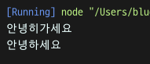
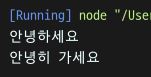

## 1주차 - 3.Async, Callback

[[실습 코드보기]](https://github.com/LikeLionSCH/LikeLion_React_Study_Summary/tree/master/3_Async_Callback.js)

### Asynchronous (비동기성)

-   절차적으로 진행되지 않는 특성
-   실행 결과가 반환되기 전에 다른 코드를 실행 가능

#### 예제

```javascript
setTimeout(() => {
    console.log("안녕하세요");
}, 2000);

console.log("안녕히가세요");
```

`console.log("안녕하세요")`가 `console.log("안녕히가세요")`보다<br/>
먼저 작성되어 있지만 아래와 같이 `안녕히가세요`가 **먼저 출력**된다.<br>

<br>

#### 비동기성의 이유

-   **자바스크립트**는 **웹**에 치중되어 있다.
-   인터넷 **속도**에 **의존적**이다.
-   사용자의 **인터랙션**이 **존재**한다.

속도가 **느려도** **인터랙션**은 되어야 한다.<br>

### Call back

**다른 코드**의 **인수**로서 넘겨주는 실행 가능한 **코드**<br>
**콜백**으로 넘겨받은 코드는 **즉시 실행**할 수도 있고, **나중에 실행**될 수도 있다.<br>
**콜백 함수**는 보통 아래와 같은 구조를 가진다.<br>

```javascript
function doSomethingElseAsync(callback) {
    console.log("doSomethingElseAsync : Wait for half a sec.");
    setTimeout(function() {
        callback();
    }, 500);
}
```

#### 예제

```javascript
function sayHello(sayGoodbye) {
    setTimeout(() => {
        console.log("안녕하세요");
        sayGoodbye();
    }, 2000);
}

sayHello(() => console.log("안녕히 가세요"));
```

**비동기성**의 예제와 다르게 `안녕하세요`가 먼저 출력되고 `안녕히 가세요`가 출력된다.<br>
여기서 **인자**로 받은 `sayGoodbye`는 **callback함수**로서 받아졌다.<br>

<br>

#### Callback Hell

**비동기 로직 처리**를 위해 **콜백 함수**를 **연속적으로 사용**할 때 발생하는 문제<br>
아래와 같은 연속적인 **콜백 함수**의 사용으로 가독성을 해친다.<br>

```javascript
a(function(resultFromA) {
    b(resultFromA, function(resultFromB) {
        c(resultFromB, function(resultFromC) {
            d(resultFromC, function(resultFromD) {
                e(resultFromD, function(resultFromE) {
                    f(resultFromE, function(resultFromF) {
                        console.log(resultFromF);
                    });
                });
            });
        });
    });
});
```

해결 방법으로는 `Promise`와 `async - await Fun`이 존재한다.<br>
