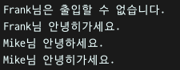
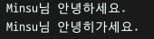
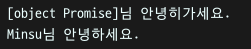

## 1주차 - 4.Promise, Async - Await

[[실습 코드보기]](https://github.com/LikeLionSCH/LikeLion_React_Study_Summary/tree/master/4_Promise_Async_Await.js)

### Promise

언젠가 해결될 것이라는 **약속**이라는 뜻<br>

```javascript
new Promise((resolve, reject) => {});
```

`then`이나 `catch`를 사용해서 **성공**하거나 **실패**했을 때에<br>
나온 결과를 이후에 **동기적**으로 처리하도록 한다.<br>

#### Promise 사용 이전

```javascript
function sayHello(name, byeCallback) {
    setTimeout(() => {
        console.log(name + "님 안녕하세요.");
        byeCallback();
    }, 2000);
}

sayHello("Mike", function() {
    console.log("안녕히 가세요");
});
```

#### Promise 사용 이후

여기에서 `resolve`는 처리에 성공했을 때 실행되는 `callback`함수이고<br>
`reject`는 처리에 실패했을 때 실행되는 `callback`함수다.<br>

```javascript
function sayHello(name) {
    return new Promise((resolve, reject) => {
        setTimeout(() => {
            console.log(name + "님 안녕하세요.");
            resolve();
        }, 2000);
    });
}
```

아래와 같이 `Promise`가 정의된 함수를 호출한 후 `then`을 사용해<br>
`callback`함수를 넘기면 처리에 성공할 경우 `then`으로 넘어간 함수가 실행된다.<br>

```javascript
sayHello("Frank").then(() => console.log("안녕히 가세요."));
```

아래와 같이 이전과 동일한 결과를 확인할 수 있다.<br>

<br>

#### Prmoise 활용하기

아래와 같이 `resolve`와 `reject`함수에도 **값을 넘길 수 있으며**<br>
아래처럼 특정 조건에 따라 **성공**, **실패**를 나누어 사용 가능하다.<br>

```javascript
function sayHello(name) {
    return new Promise((resolve, reject) => {
        setTimeout(() => {
            if (name === "Mike") {
                console.log(name + "님 안녕하세요.");
                resolve(name);
            } else {
                console.log(name + "님은 출입할 수 없습니다.");
                reject(name);
            }
        }, 2000);
    });
}

sayHello("Frank")
    .then(name => console.log(name + "님 안녕히가세요."))
    .catch(name => console.log(name + "님 안녕히가세요."));

sayHello("Mike")
    .then(name => console.log(name + "님 안녕히가세요."))
    .catch(name => console.log(name + "님 안녕히가세요."));
```

우리가 넘겨준 값인 `name`이 잘 전달되어 출력되는 것을 확인할 수 있고<br>
특정 조건에 따라 성공(`resolve`)나 실패(`reject`)로 상황을 나누어<br>
`then`과 `catch`로 전달받은 `callback`함수가 실행되도록 할 수 있다.<br>

<br>

### Async - Await

`then`을 조금 더 직관적으로 사용하고 싶을 때 사용하는 방식<br>
아래와 같은 기본적인 구조로 `async`, `await`을 사용한다.<br>

```javascript
async function_name(p) {
    const result = await get_result()
}
```

여기서 `get_result`함수는 **비동기적**으로 실행되는 함수이며<br>
`await`키워드를 붙여 호출하게 되면 해당 함수가 **끝날때 까지 기다린다**.<br>

#### 예제

**비동기적**으로 처리되는 `sayHelloAsync`함수가 아래와 같이 정의되어 있다.<br>
`async`, `await`을 사용하기 위해 `async`키워드를 사용한 함수 `sayByeAsync`를 정의하고<br>
함수내부에 `sayHelloAsync`함수가 끝날 때 까지 기다리도록 `await`키워드를 넣어 호출한다.<br>

```javascript
function sayHelloAsync(name) {
    return new Promise(resolve => {
        setTimeout(() => {
            console.log(name + "님 안녕하세요.");
            resolve(name);
        }, 2000);
    });
}

async function sayByeAsync(name) {
    const result = await sayHelloAsync(name);
    console.log(result + "님 안녕히가세요.");
}

sayByeAsync("Minsu");
```

아래와 같이 `sayHelloAsync`가 호출된 후 아래의 `console.log`가 실행되었다.<br>
또한 `Promise`내부의 `resolve`함수에 **인자**로 넘겨 주었던 `name`을<br>
`sayHelloAsync`함수의 **결과값**으로 받을 수 있는 것을 확인할 수 있다.<br>

<br>

`await`키워드를 삭제하고 함수를 호출하게 되면 아래와 같은 결과가 반환된다.<br>
이미 약속되어 있는 값(`Promise`)이 제대로 받아지지 않아 아래의 결과가 반환된다.<br>

<br>
