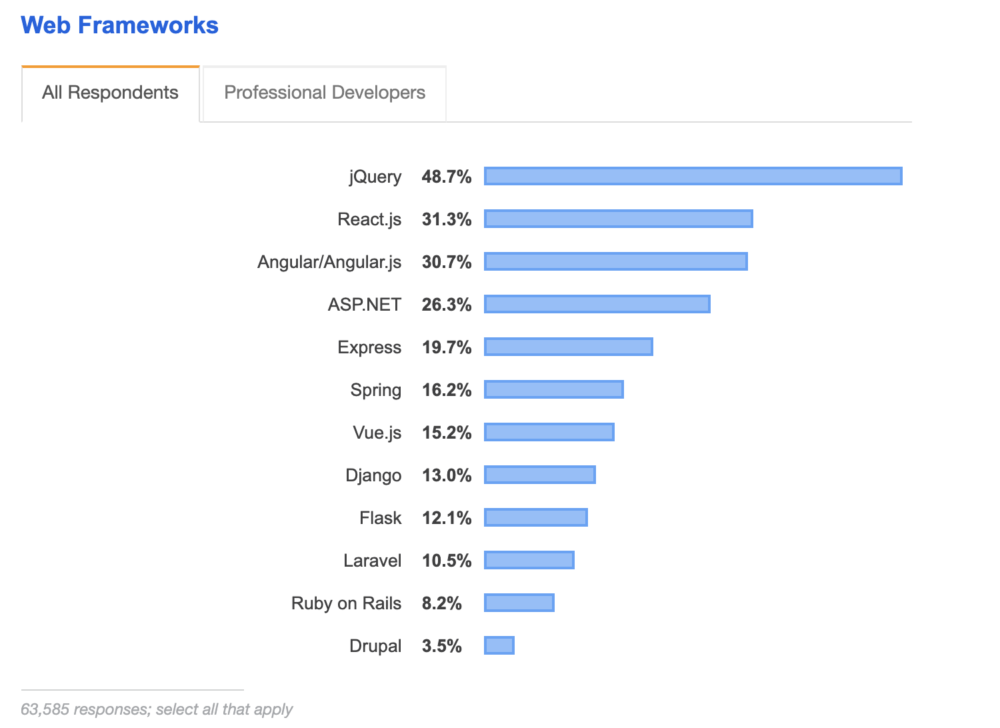
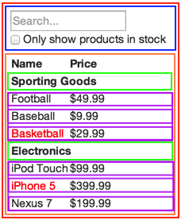

## 2주자 - 1.React 개요 (1)

### React란?

**Facebook**에서 제작한 **웹 프레임워크** 
비교되는 대상으로는 **Angular.js**나 **Vue.js**가 있다. 

#### stackoverflow Developer Survey Results 2019

개발자의 성지인 **스택오버플로우**의 통계에 따르면 웹 프레임워크 중 **2위**를 
차지할 정도로 많이 사용되어지고 있는 웹 프레임워크 중 하나이다. 

 

위의 통계에서 `React`나 `Vue`같은 프레임워크는 **프론트엔드**를 위한 프레임워크고 
`Express`나 `Spring`, `Django`는 **백 엔드**를 위한 웹 프레임워크다. 

### React의 장점

#### 선언형

**선언형 뷰**는 코드를 **예측 가능**하고 **디버그**하기 **쉽게** 만든다. 
웹에서 **상호작용**이 많은 **UI**를 만들 때 생기는 어려움을 해소해준다. 
웹 어플리케이션의 각 **상태에 대한** 간단한 **뷰**만 설계하면 된다. 
**데이터**가 **변경**됨에 따라 **변경된 컴포넌트**만 효율적으로 **갱신** 및 \*\*렌더링\*\*한다. 

#### 컴포넌트 기반

**컴포넌트 로직**이 템플릿이 아닌 **Javascript**로 작성한다. 
따라서 **다양한 형식의 데이터**를 **손쉽게 전달**이 가능하다. 
**DOM**과는 별개로 스스로 **상태를 관리**하는 **컴포넌트**로 구성되어있다. 

#### 많은 부분에 사용 가능

**Node**를 이용해 서버를 구성해 렌더링이 가능하다. 
**React Native**를 이용한 **멀티 플랫폼 어플리케이션** 구현이 가능하다. 

### DOM이란?

**D**ocument **O**bject **M**odel의 약자 
여기서 **Document**란 `HTML`을 뜻하며 **DOM**은 아래와 같은 **웹 페이지의 구조**를 뜻한다. 

 

위의 **DOM**은 `body`는 `h1`과 `div`가 묶여있고 `div`는 `p`두개와 묶여있는 구조를 갖는다. 
따라서 **DOM**은 거대한 **트리 구조**로 되어있고 웹에서 동작하는 형태다. 

### 컴포넌트란?

**컴포넌트**는 프로그래밍에 있어 **재사용이 가능한** 각각의 **독립된 모듈**을 뜻한다. 
**레고**와 비슷하게 작성된 **컴포넌트**를 모아 웹 어플리케이션을 구성할 수 있다. 
**React**공식문서에 있는 아래의 이미지로 **컴포넌트**를 설명할 수 있다. 

 

위의 이미지에는 크게 5개의 컴포넌트가 존재한다. 

1. 모든 것을 감싸고 있는 **빨간색 컴포넌트**
2. 사용자의 입력을 받는 **파란색 컴포넌트**
3. 사용자의 입력을 기반으로 데이터를 보여주는 **주황색 컴포넌트**
4. 검색 카테고리 헤더을 보여주는 **초록색 컴포넌트**
5. 검색 결과를 보여주는 **보라색 컴포넌트**

**DOM**은 `HTML`문서의 구조 자체며 **컴포넌트**는 그 구조를 **추상화**한 것이다. 
