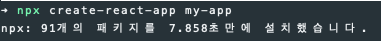
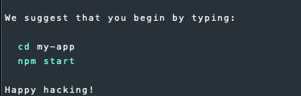
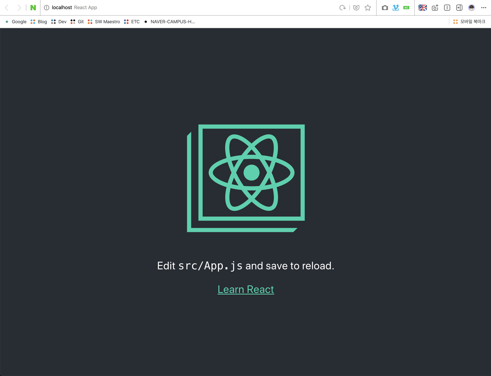
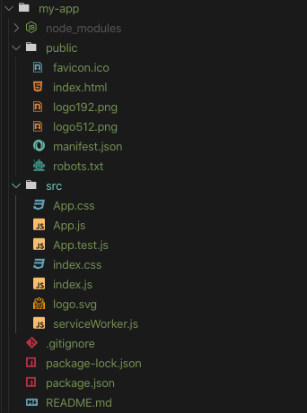
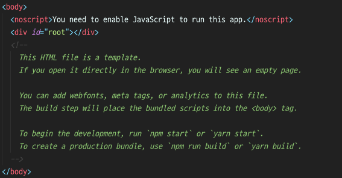
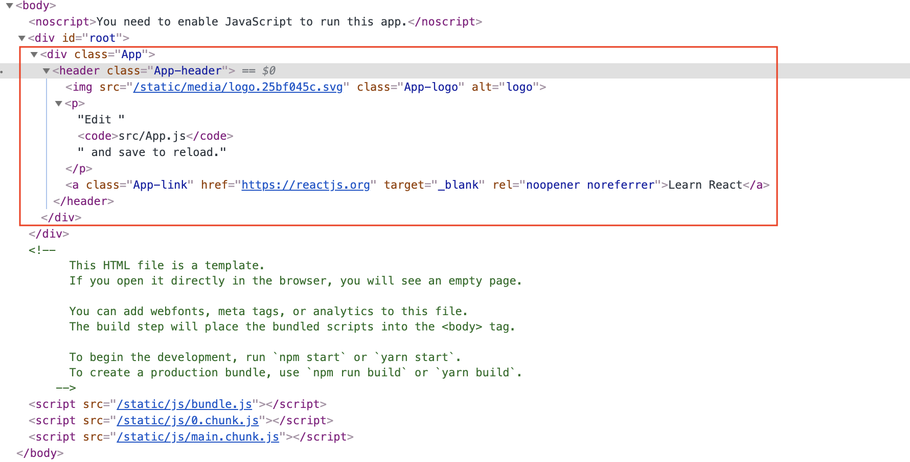
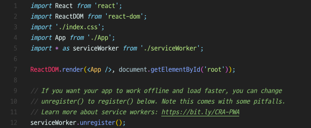
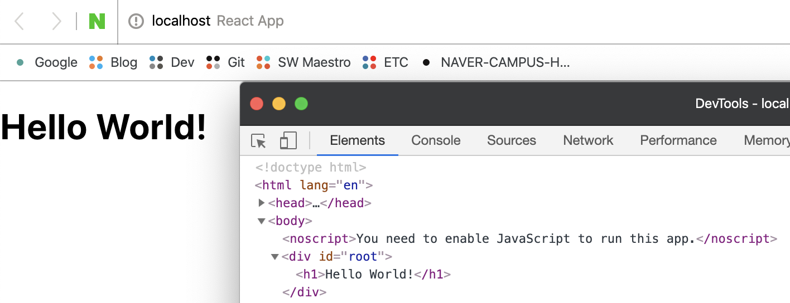
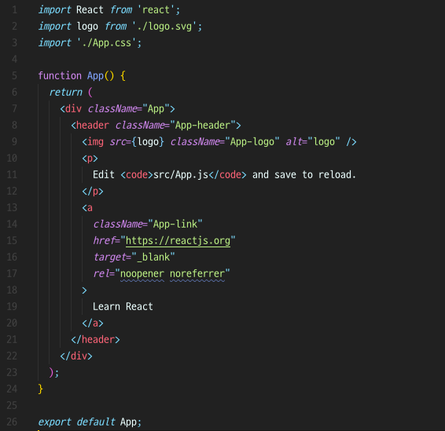
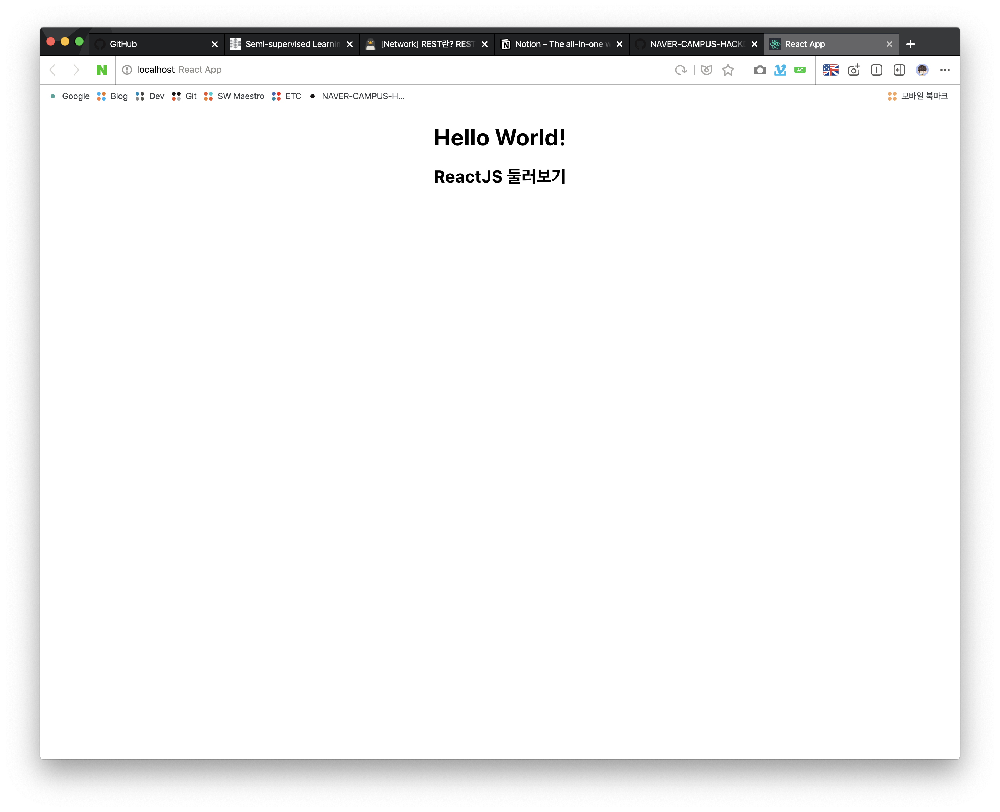

## 2주차 - 3.create-react-app

### NPM

**N**ode **P**ackage **M**anager의 약자<br>
`Node.js`의 다양한 라이브러리들을 관리해주는 도구<br>
`Python`에서 비슷한 도구로는 `pip`가 존재한다.<br>

#### NPM의 특징

1. 개별 프로젝트 폴더에 따로 설치 가능
2. 전체적으로 사용하도록 설치 가능 (`-g`, `global`)
3. `npm`으로 시작하는 명령어로 사용
4. `npx`와 같이 모듈 설치 없이 사용할 수 있게 해주는 툴 존재

### Node.js 설치 및 확인

[https://nodejs.org](https://nodejs.org/en/)로 이동해서 운영체제와 맞는 버전을 설치한다.<br>

-   `node.js`버전 확인 명령어

```
node --version
```

-   `npm`버전 확인 명령어

```
npm --version
```

위의 두 명령어가 잘 작동하면 문제없이 잘 설치된 것이다.<br>

### npx로 React앱 생성하기

아래의 명령어를 터미널에 작성하면 따로 `react`를 설치하지 않아도 앱이 생성된다.<br>

```
npx create-react-app my-app
cd my-app
npm start
```

아래와 같이 `React`앱이 잘 생성된 것을 확인할 수 있다.<br>

<br>
<br>

`my-app`폴더로 이동후 `npm start`명령어를 사용하면 아래와 같은 앱이 실행된다.<br>

<br>

### React 구조 이해하기

새로운 `React`앱을 생성하고 폴더를 보면 아래와 같은 구조로 되어있다.<br>

<br>

-   `node_modules` : 설치한 패키지들이 저장되어 있는 폴더

`App.js`와 `index.js`, `index.html`이 핵심이되는 파일이다.<br>

### index.html

`public`폴더의 `index.html`을 열어보면 `body`태그는 아래와 같다.<br>
`noscript`태그와 `root`라는`id`값을 갖는 태그 하나 만 존재한다.<br>

<br>

하지만 **개발자 도구**를 사용해서 소스코드를 확인하면 아래와 같이<br>
`index.html`에는 작성되어있지 않은 태그들이 존재하는 것을 확인할 수 있다.<br>

<br>

### index.js

`index.html`과 이름이 비슷한 `index.js`를 보면 아래의 코드가 작성되어있는 것을 볼 수 있다.<br>

<br>

이 코드의 핵심 부분은 아래와 같다.<br>
`ReactDom`이 `App`컴포넌트를 `document`에서 `id`값이 `root`인 태그안에 **랜더링** 해준다는 의미다.<br>

```javascript
ReactDOM.render(<App />, document.getElementById("root"));
```

위의 코드를 아래와 같이 수정해보자.

```javascript
ReactDOM.render(<h1>Hello World!</h1>, document.getElementById("root"));
```

우리가 작성한 `<h1>Hello World!</h1>`가 `root`안에 랜더링 되는 것을 볼 수 있다.<br>

<br>

### App.js

우리가 개발자 도구에서 보았던 컴포넌트는 `App.js`에 아래와 같이 작성되어 있다.<br>

<br>

`App.js`를 아래와 같이 수정해보고 새로고침해보자.<br>

```javascript
import React from "react";
import logo from "./logo.svg";
import "./App.css";

function App() {
    return (
        <div className="App">
            <h1>Hello World!</h1>
            <h2>ReactJS 둘러보기</h2>
        </div>
    );
}

export default App;
```

우리가 작성한 `HTML`태그들이 잘 보여지는 것을 확인할 수 있다.<br>

<br>

### App.js 구조 이해하기

우리가 작성한 `App.js`의 구조는 아래와 같이 설명할 수 있다.<br>

-   필요한 모듈을 추가하는 부분

```javascript
import React from "react";
import logo from "./logo.svg";
import "./App.css";
```

-   이름이 `App`인 **함수형 컴포넌트**

```javascript
function App() {
    return (
        <div className="App">
            <h1>Hello World!</h1>
            <h2>ReactJS 둘러보기</h2>
        </div>
    );
}
```

-   작성한 컴포넌트를 내보내는 부분

아래와 같이 `export`로 내보낸 **컴포넌트**는 다른 파일에서 `import`해 사용 가능하다.<br>
`default`는 이 파일에서 기본적으로 `App` 컴포넌트 **하나만** `export`한다는 의미다.<br>

```javascript
export default App;
```
