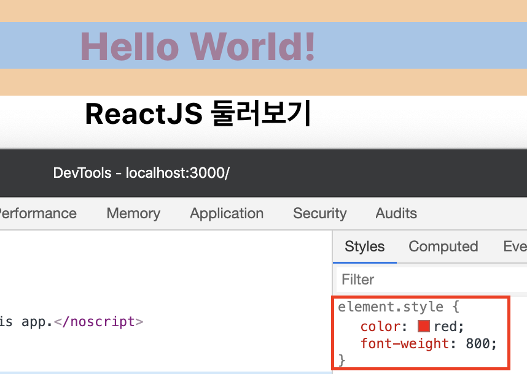
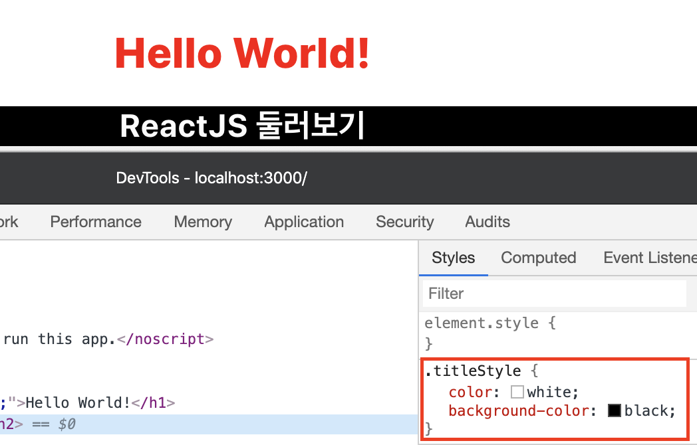

## 2주차 - 4.JSX

### JSX

**J**ava**S**cript **X**ML의 약자<br>
`Javascript`에서 사용하는 `HTML`과 비슷하다.<br>

#### 특징

1. **태그** 이름은 기존 `HTML`과 거의 **유사**하다.
2. **Attributes**나 **css**는 **카멜 케이스**를 사용한다. (`className`, `textAlign`)
3. `Javascript코드`를 활용하기 위해서는 `{ }`를 이용한다.

### JSX 사용해보기

이전과 동일하게 아래의 명령어를 사용해 `React`앱을 생성해줍니다.<br>

```
npx create-react-app my-app
```

앱 생성이 완료되었다면 `App.js`파일을 아래와 같이 수정합니다.<br>

```javascript
import React from "react";
import "./App.css";

function App() {
    return (
        <div className="App">
            <h1>Hello World!</h1>
            <h2>ReactJS 둘러보기</h2>
        </div>
    );
}

export default App;
```

#### h1 태그에 스타일 입혀보기

`App.js`에서 `App`함수를 아래와 같이 수정한다.<br>

```javascript
function App() {
    return (
        <div className="App">
            <h1 style={{ color: "red" }}>Hello World!</h1>
            <h2>ReactJS 둘러보기</h2>
        </div>
    );
}
```

`style={{...}}`에서 첫번째 **중괄호**는 JS코드가 들어간 다는 것을 의미를 갖고<br>
그 안에있는 `{ color: "red }`는 하나의 스타일 정보를 가지고 있는 `Object`다.<br>

<br>

위와 같이 스타일이 잘 적용된 것을 확인할 수 있게되었다.<br>
아래 처럼 직접 넣지 않고 밖에서 코드를 작성하여 넣을 수도 있다.<br>

```javascript
...
const headerStyle = {
    color: "red",
};

function App() {
    return (
        <div className="App">
            <h1 style={headerStyle}>Hello World!</h1>
            <h2>ReactJS 둘러보기</h2>
        </div>
    );
}
...
```

`css`에서의 `font-weight`과 같은 속성을 주기위해서는 **카멜 케이스**를 사용한다.<br>

```javascript
...
const headerStyle = {
    color: "red",
    fontWeight: 800
};
...
```

<br>

우리가 의도한 스타일이 잘 적용되었음을 개발자 도구로 확인할 수 있다.<br>

#### h2태그에 클래스 지정해보기

위의 방식과 같이 `style`속성만 이용하다보면 코드가 복잡해질 가능성이 있다.<br>
따라서 기존의 `HTML`에서 사용했던 방법과 동일하게 **클래스**를 사용할 수 있다.<br>

```javascript
function App() {
    return (
        <div className="App">
            <h1 style={headerStyle}>Hello World!</h1>
            <h2 className={"titleStyle"}>ReactJS 둘러보기</h2>
        </div>
    );
}
```

위와 같이 `className`이라는 속성을 주어 **클래스**를 지정할 수 있다.<br>
클래스가 잘 지정되었는지 `App.css`에 아래의 코드를 추가한 후 새로고침 해보자.<br>

```css
.titleStyle {
    color: white;
    background-color: black;
}
```

<br>

우리가 지정한 `titleStyle`클래스에 `css`가 잘 적용된 것을 확인할 수 있다.<br>
