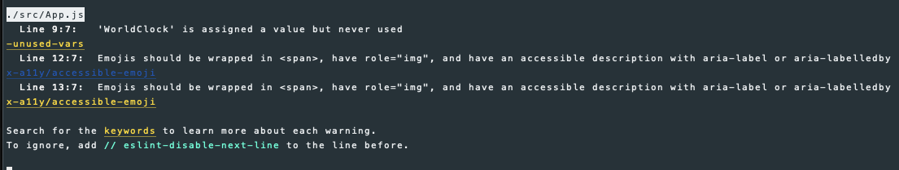
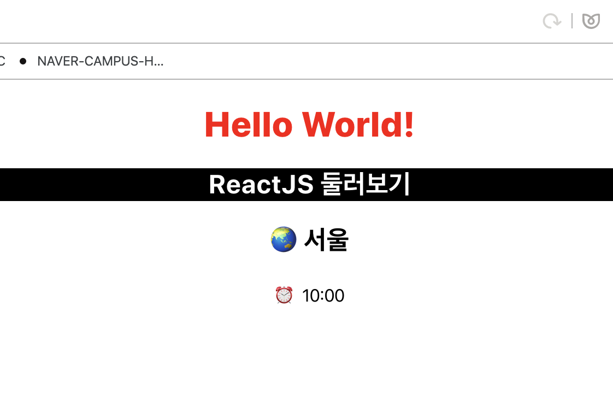
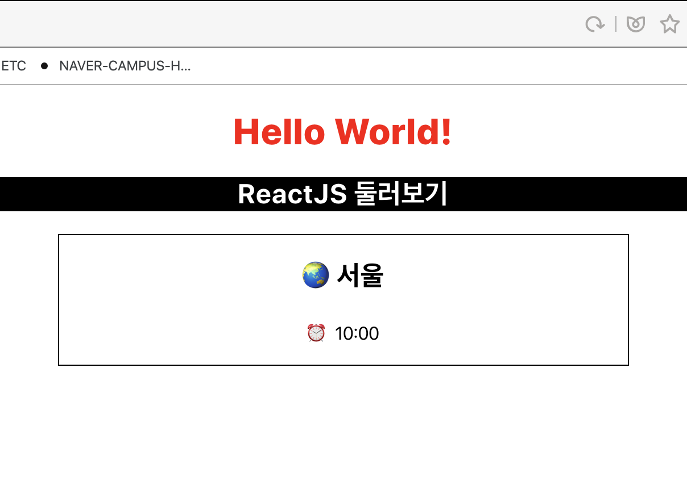
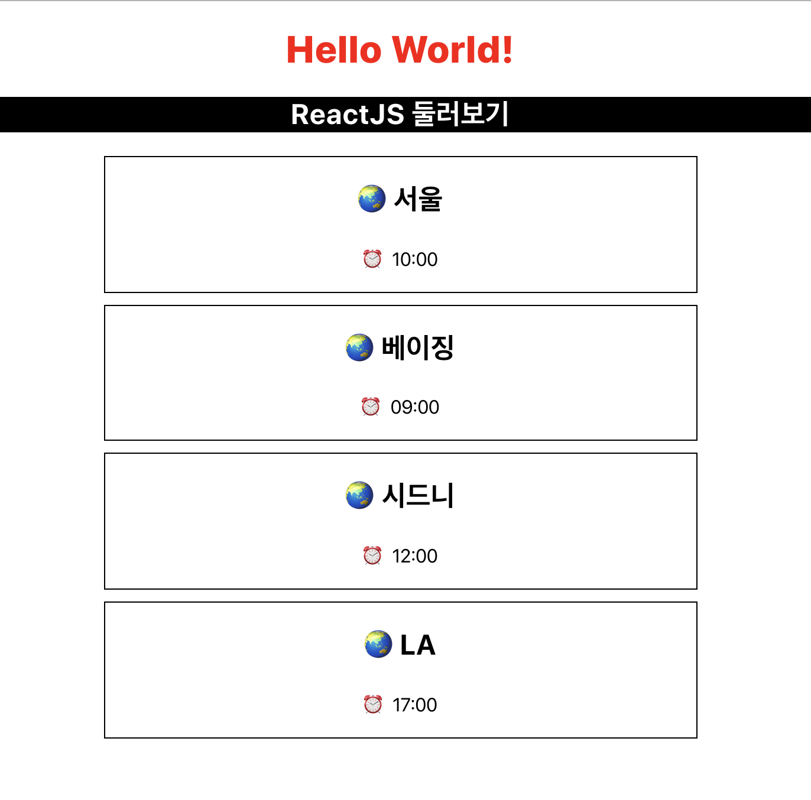

## 3주차 - 1.Props

### Props란?

**컴포넌트**간 **데이터**를 이동하는 **수단**<br>
`Props`는 **Read Only**로 읽기만 수행 가능하므로 변경이 불가능하다.<br>

### Props 실습으로 이해하기

지난 [강의](https://alstn2468.github.io/2019/JSX/)에 사용했던 [코드](https://github.com/LikeLionSCH/LikeLion_React_Study_Summary/tree/master/2_JSX/my-app)를 기반으로 세계 시간을 보여주는 앱을 제작해보겠습니다.<br>

컴포넌트는 아래와 같이 함수를 이용해서 작성할 수 있다.<br>

```javascript
const WorldClock = props => {
  return <div></div>;
};
```

위의 컴포넌트는 `WorldClock`이라는 이름을 갖고 `props`를 인자로 받는 컴포넌트다.<br>

아래의 컴포넌트는 `props`를 통해서 도시의 이름과 시간이 전달된다고 가정한 컴포넌트다.<br>

```javascript
const WorldClock = props => {
  return (
    <div className="WorldClock">
      <h2>🌏 {props.city}</h2>
      <p>⏰ {props.time}</p>
    </div>
  );
};
```

위와 같이 작성한 후 콘솔을 확인하게 되면 아래의 경고들을 확인할 수 있다.<br>

<br>

우리가 작성한 `WorldClock`이 아직 사용되지 않았다는 경고와<br>
이모지를 사용할 경우 `span`태그에 `role`속성과 `aria-label`속성을 추가하라는 경고다.<br>
아래와 같이 코드를 수정하면 이모지와 관련된 경고는 사라지게 된다.<br>

```javascript
const WorldClock = props => {
  return (
    <div className="WorldClock">
      <h2>
        <span role="img" aria-label="Earth Emoji">
          🌏
        </span>{" "}
        {props.city}
      </h2>
      <p>
        <span role="img" aria-label="Clock Emoji">
          ⏰
        </span>{" "}
        {props.time}
      </p>
    </div>
  );
};
```

작성한 `WorldClock`컴포넌트를 사용하기 위해서는 `App`함수를 아래와 같이 변경하면 된다.<br>

```javascript
function App() {
  return (
    <div className="App">
      <h1 style={headerStyle}>Hello World!</h1>
      <h2 className={"titleStyle"}>ReactJS 둘러보기</h2>
      <WorldClock city="서울" time="10:00" />
    </div>
  );
}
```

`WorldClock`컴포넌트의 `city`에 서울이라는 값을 넘겨주고 `time`에 10:00을 넘겨 주었다.<br>
`WorldClock`컴포넌트를 사용하면서 모든 경고가 사라지고 아래의 결과를 확인할 수 있다.<br>

<br>

우리가 전달한 `props`가 `WorldClock`컴포넌트에 잘 전달된 것을 확인할 수 있다.<br>
컴포넌트 간의 약간의 구분을 두기 위해 `App.css`에 아래의 코드를 추가한다.<br>

```css
.WorldClock {
  border: 1px solid black;
  width: 500px;
  margin: 0 auto 10px auto;
}
```

우리가 지정한 스타일이 잘 적용되는 것을 확인할 수 있다.<br>

<br>

세계 시간을 보여주는 것을 목적으로 하기 때문에 여러개의 도시를 출력해보자.<br>
`App.js`의 `App`함수를 아래와 같이 수정하면 된다.<br>

```javascript
function App() {
  return (
    <div className="App">
      <h1 style={headerStyle}>Hello World!</h1>
      <h2 className={"titleStyle"}>ReactJS 둘러보기</h2>
      <WorldClock city="서울" time="10:00" />
      <WorldClock city="베이징" time="09:00" />
      <WorldClock city="시드니" time="12:00" />
      <WorldClock city="LA" time="17:00" />
    </div>
  );
}
```

추가한 3개의 `WorldClock`컴포넌트 또한 잘 보여지는 것을 확인할 수 있다.<br>

<br>

`WorldClock`컴포넌트에서 `city`와 `time`속성이 `props`로 사용되어지고 있으며<br>
각각 다른 데이터가 `WorldClock`컴포넌트의 `props`로 넘어가 출력되는 것을 볼 수 있다.<br>
