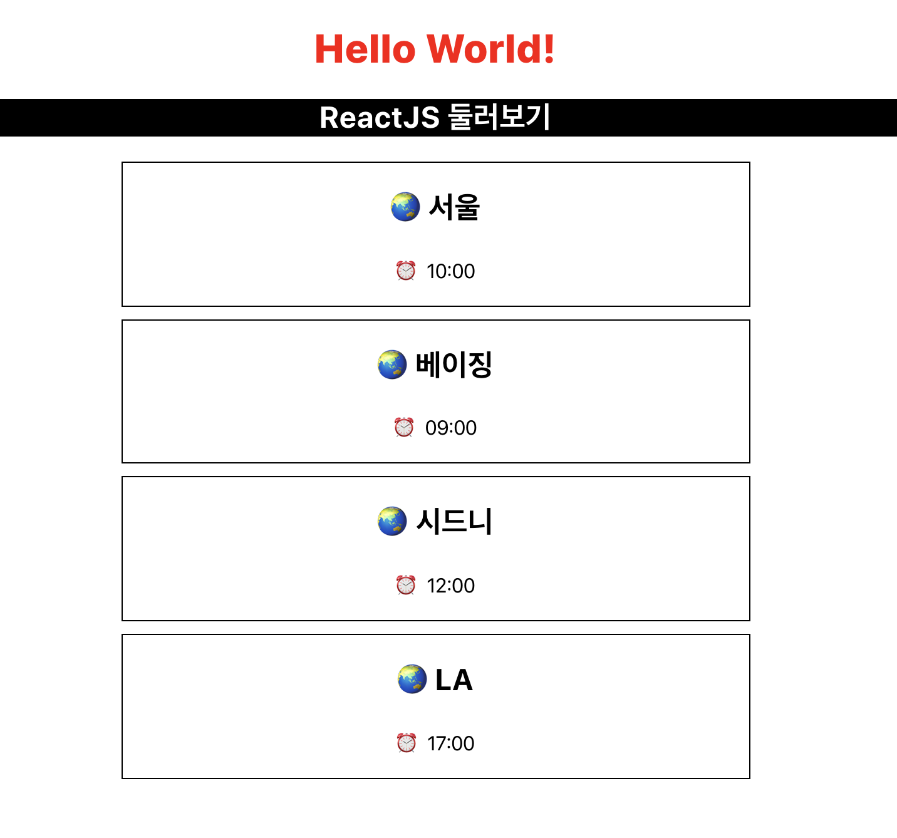
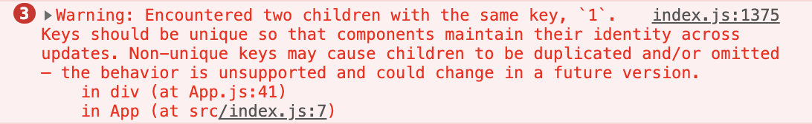
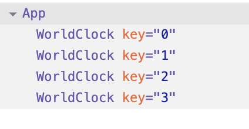

## 3주차 - 2.List&Key

### 중복의 발생

우리가 작성한 `WordClock` 컴포넌트를 여러개 생성하기 위해서<br>
아래와 같이 여러개의 컴포넌트를 모두 작성해 사용했었다.<br>

```javascript
<WorldClock city="서울" time="10:00" />
<WorldClock city="베이징" time="09:00" />
<WorldClock city="시드니" time="12:00" />
<WorldClock city="LA" time="17:00" />
```

이와 같이 사용할 경우 같은 컴포넌트가 **중복**되는 것을 볼 수 있다.<br>

### 중복의 제거

아래와 같이 **배열**을 생성해 중복된 컴포넌트에 들어간 데이터를 옮겨보자.<br>
`App`함수에 `cityTimeDate`라는 배열을 생성해 주었다.<br>

```javascript
function App() {
    const cityTimeData = [
        ['서울', '10:00'],
        ['베이징', '09:00'],
        ['시드니', '12:00'],
        ['LA', '17:00']
    ];
    ...
}
```

위와 같이 작성한 배열을 사용하기 위해서는 `map`함수를 사용한다.<br>
`map`함수의 첫번째 인자로는 사용할 **함수**가 들어가게 된다.<br>
따라서 우리는 `cityTimeData`배열의 각 데이터를 `cityTime`이라는 이름으로<br>
사용하고 데이터를 컴포넌트의 `props`로 넣어 사용하도록 작성한다.<br>

```javascript
function App() {
    const cityTimeData = [
        ['서울', '10:00'],
        ['베이징', '09:00'],
        ['시드니', '12:00'],
        ['LA', '17:00']
    ];

    const WorldClockList = cityTimeData.map(cityTime => (
        <WorldClock city={cityTime[0]} time={cityTime[1]} />
    ));

    return (
        <div className="App">
            <h1 style={headerStyle}>Hello World!</h1>
            <h2 className={'titleStyle'}>ReactJS 둘러보기</h2>
            {WorldClockList}
        </div>
    );
}
```

아래와 같이 이전의 코드와 동일하게 작동하는 것을 확인할 수 있다.<br>

<br>

### Key

이전과 동일하게 코드는 작동하지만 개발자 도구를 확인하면<br>
`Each child in an array should have a unique "key" prop.`<br>
위와 같은 경고가 떠 있는 것을 볼 수 있을 것이다.<br>

써있는 그대로 `child`컴포넌트 즉 `WorldClock`컴포넌트에<br>
고유한 값을 `key`라는 이름으로 `prop`을 추가해주면 된다.<br>

```javascript
const WorldClockList = cityTimeData.map(cityTime => (
    <WorldClock city={cityTime[0]} time={cityTime[1]} key={1} />
));
```

위와 같이 `key`값에 1이라는 값을 넣었을 경우 아래와 같은 경고가 발생한다.<br>

<br>

1의 키를 갖는 동일한 컴포넌트가 존재한다는 경고를 확인할 수 있다.<br>
`map`함수에 작성한 `WorldClock`을 반환하는 함수에 `idx`를 추가로 받아<br>
`WorldClock`컴포넌트에 `idx`값을 `key`로 전달하였다.<br>

```javascript
const WorldClockList = cityTimeData.map((cityTime, idx) => (
    <WorldClock city={cityTime[0]} time={cityTime[1]} key={idx} />
));
```

아래 처럼 각각의 컴포넌트에 `key`가 잘 전달된 것을 확인할 수 있다.<br>

<br>

이러한 `Key`는 `React`에서 컴포넌트의 **추가**, **변경**, **삭제**를 확인하는데 사용한다.<br>
**컴포넌트의 변화**가 발생하는 구간을 정확하고 빠르게 알기위해 사용하는 것이다.<br>